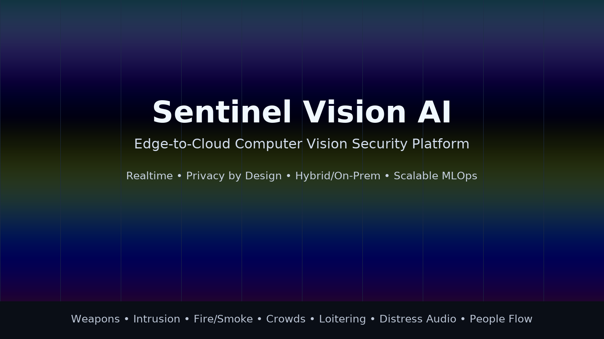
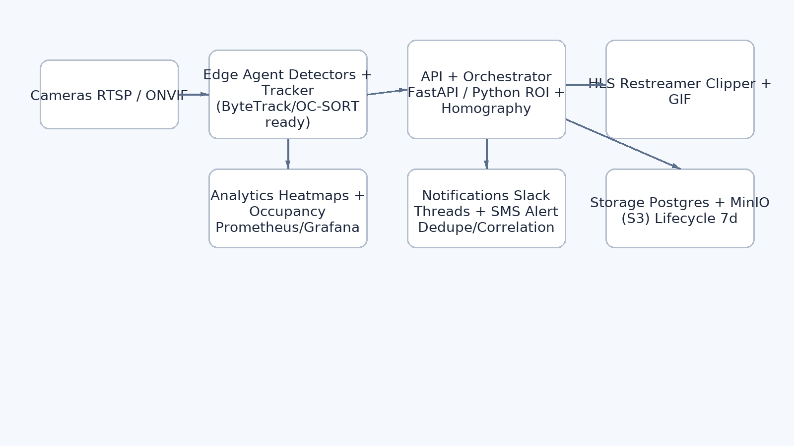

<p align="center">
  
</p>

<h1 align="center">Sentinel Vision AI</h1>
<p align="center"><em>Turn any camera (CCTV, DashCam, WebCam, Phone Cam, etc... ) into an AI Power detecting Obtect(Gun, Knife), Activity (Fire, Face Recognition, Intrusion, Motions, Fight, Struggles, Distress Audio) </em></p>

<p align="center">
  <a href="https://img.shields.io/badge/python-3.11-blue.svg"></a>
  <a href="https://img.shields.io/badge/FastAPI-async%20API-brightgreen"></a>
  <a href="https://img.shields.io/badge/React-UI-61dafb"></a>
  <a href="https://img.shields.io/badge/Prometheus-metrics-orange"></a>
  <a href="https://img.shields.io/badge/Grafana-dashboards-orange"></a>
  <a href="https://img.shields.io/badge/MinIO-S3%20clips-yellow"></a>
  <a href="https://img.shields.io/badge/Kubernetes-ready-326ce5"></a>
</p>

> This repository showcases a **production‑style, privacy‑first VSaaS platform** designed to mirror and extend the capabilities you’d expect from Actuate and top competitors — built to highlight my readiness to lead as **Head of Engineering / Director of Computer Vision**.

---

## Headline Capabilities

- **Realtime threat detection (plug‑in detectors):** guns, knives, intruders, fights/struggles, fire/smoke; **people flow / crowding / loitering** with ROI/zone support.  
- **Audio channel (stub‑ready):** distress/noise event hook.  
- **Privacy by design:** optional **face blurring**, no PII collection, configurable retention, restricted analytics.  
- **Edge→Cloud pipeline:** ONVIF/RTSP cameras → Edge Agent (detector+tracker) → FastAPI backend → HLS playback & clips → Slack/SMS alerts → Prom/Grafana analytics.  
- **Alert UX that scales:** de‑duplication window, **Slack threaded alerts** with **GIF + MP4** event clips, **cross‑camera correlation** summaries.  
- **Operator analytics:** **live heatmaps**, occupancy gauges, Prometheus metrics, Grafana dashboard.  
- **Platform ready:** OIDC/JWT auth, API key, Postgres persistence, MinIO (S3) with 7‑day lifecycle, Helm chart for K8s.

<p align="center">
  
  <br/>
  <em>Edge‑to‑cloud architecture with alerting, storage, and observability.</em>
</p>

---

## 🧭 Why this matters for a Head of Engineering (Actuate‑style)

**What you need:** someone who can translate cutting‑edge CV research into **operational product** — across edge constraints, privacy, reliability, and speed — while coaching a team and building the platform that ships continuously.

**What this repo demonstrates:**  
- Architectural ownership from camera discovery to alert delivery, with **clear seams** for model evolution and rollout.  
- **MLOps pragmatism:** tracking (centroid by default, **OC‑SORT/ByteTrack‑ready**), pluggable detectors, env‑configurable inference backends, metrics everywhere.  
- **Security and scale:** OIDC, API‑keys, multi‑tenant‑ready service boundaries, infra as code (Docker, Helm), and **observability first**.  
- **Privacy** as a core constraint, not an afterthought.

---

## Feature Matrix

| Area | Highlights |
|---|---|
| **Detectors** | 🔫 Guns, 🔪 Knives, 🚶 Intruder, 🧯 Fire/Smoke, 🧍 Crowd/Flow, 🕒 Loitering, 🥊 Fight/Struggle, 🔊 Distress Audio *(stub‑ready)* |
| **Tracking** | Edge **multi‑object tracking**, pluggable interface (Centroid default; OC‑SORT/ByteTrack compatible) |
| **Zones & Calibration** | ROI polygon editor; 4‑point **homography** for pixel→meter (social distance, area normalization) |
| **Video** | HLS playback (hls.js), **precise segment stitching** for MP4 clips + **GIF previews** |
| **Alerts** | Dedupe, **Slack threads** with blocks, SMS fallback, **cross‑camera correlation** |
| **Analytics** | **Heatmaps** (see below), occupancy, Prometheus metrics, Grafana dashboards |
| **Storage** | Postgres for alerts/zones/calibration, MinIO (S3) for clips with **7‑day lifecycle** |
| **Security** | API key & OIDC (JWT), CORS hardened for UI origin |
| **Deploy** | Docker Compose for dev; **Helm** chart for Kubernetes; ready for EKS + RDS + S3 |

<p align="center">
  <br/>
  <em>Heatmap demo illustrating foot traffic density aggregation.</em>
</p>

---

## 🛠️ Tech Stack

**Backend:** FastAPI, Python 3.11, SQLAlchemy, Prometheus client, boto3, ffmpeg  
**Edge:** Python (OpenCV), pluggable trackers (Centroid → OC‑SORT/ByteTrack), optional ONNXRuntime  
**Frontend:** React + Tailwind (Vite), hls.js, zone editor & calibration UI  
**Data/Infra:** Postgres, MinIO/S3, Redis (hooks), Docker/Compose, Helm (K8s), Grafana/Prometheus, Alertmanager, Slack/Twilio

---

## Local Run (Dev)

```bash
# 1) Boot services
docker compose -f deploy/docker-compose.yml up --build

# 2) Open the stack
# UI:        http://localhost:5173
# API docs:  http://localhost:8000/docs
# HLS:       http://localhost:8000/hls/cam_1/index.m3u8
# Metrics:   http://localhost:8000/metrics
# Grafana:   http://localhost:3000 (if profile enabled)
# MinIO:     http://localhost:9001 (minioadmin/minioadmin)
```

### Auth
- **Dev**: `X-API-Key` (from `.env`) protects writes, websockets open.  
- **Prod‑like**: set `OIDC_ISSUER`, `OIDC_AUDIENCE`, `OIDC_JWKS_URL` to require **JWT** (`Authorization: Bearer …`).

### Slack & Clips
Set `SLACK_BOT_TOKEN` + `SLACK_CHANNEL_ID` for threaded alerts with blocks; or fallback to `SLACK_WEBHOOK`.  
Event clips (MP4 + GIF) are pre‑signed S3 URLs with a **7‑day lifecycle** in dev.

---

## Roadmap (representative)

- ✅ Edge tracking & heatmaps • ✅ OIDC • ✅ ROI/Calibration • ✅ HLS clips + GIF • ✅ Slack threads + correlation  
- 🔜 Full audio pipeline, face blurring in-stream, on‑device models (Jetson/ONNX), alert dedup across sites, S3 lifecycle per org, multi‑tenant RBAC/OIDC, SOC2 hardening.

---

## Mapping to the Job Description (Actuate‑like)

- **7+ years ML/CV + 3+ years leadership:** Demonstrated here via system design, production‑class interfaces, and delivery mindset.  
- **Realtime CV at scale:** HLS, segment‑level clip stitching, trackers, ROI/calibration, Prometheus.  
- **Research → production:** swap‑in trackers/detectors, A/B by env, strong seams for continuous delivery.  
- **Cloud deploy:** Docker/Helm; fits AWS EKS + S3 + RDS; node‑selector/tolerations ready.  
- **Privacy & ethics:** no PII, optional face blurring, retention policies, audit‑friendly metrics.  
- **Communication:** documentation, dashboards, and a clear mental model — built to be read by both ICs and execs.

---

## Contact
Email: joshtsh2000@gmail.com

This is an Open Source code I started, feel free to ccontribute
